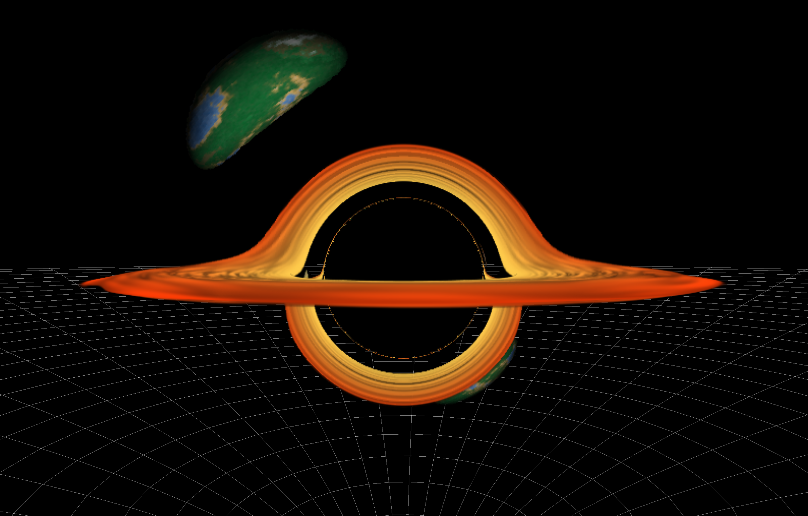
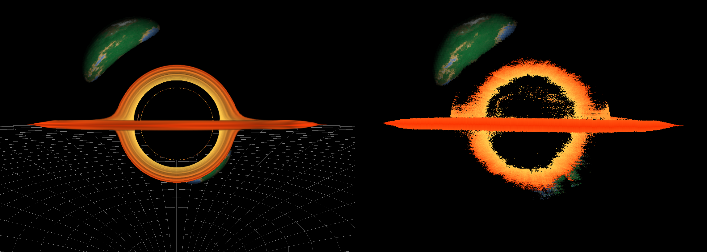
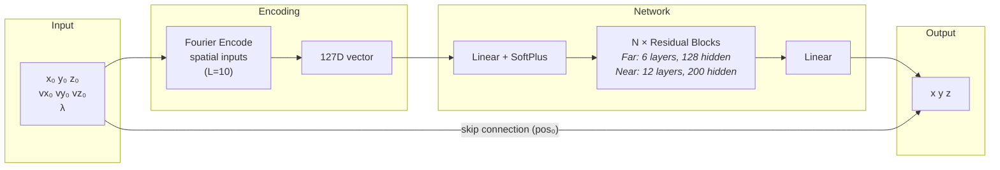

# Black Hole Simulation



A real-time black hole renderer built from scratch with OpenGL compute shaders. It traces light rays on the GPU through curved spacetime around a Schwarzschild black hole, producing real-world effects such as gravitational lensing.

I started this as a learning project to pick up a few things in one go:
- **C++** — only had a single course on it, never used it since but handy to learn for Titan
- **OpenGL** — wanted to learn to build my own rendering engine :)
- **Compute shaders** — getting into parallel GPU programming for ML purposes
- **Physics** — gotten rusty with my physics background

Plus black holes are just interesting, and most examples online are "fake" renders.

This grew from a simple raymarcher into a full simulation with geodesic integration, and eventually a Physics-Informed Neural Network (PINN) that can approximate those geodesics.

## Features
- Real-time geodesic ray tracing with gravitational lensing, accretion disk, and orbiting planets
- PINN rendering mode using dual neural networks running entirely on the GPU
- Spacetime curvature visualization
- Tweakable simulation parameters via ImGui settings panel

## How It Works

### Raytracer
The core renderer is a GPU compute shader that traces rays through Schwarzschild spacetime. Each pixel gets a ray that is stepped through curved space using the metric tensor to compute geodesics. I challenged myself to derive the Schwarzschild metric from the Einstein Field Equations myself (for which I have notes elsewhere if anyone would be interested). The result is physically accurate gravitational lensing —> light bends around the black hole, the accretion disk warps, and background objects get distorted.

### PINN Mode
Inspired by the [GravLensX paper](https://arxiv.org/abs/2507.15775), I trained a neural network to predict where a light ray ends up given its starting position, direction, and travel distance. Instead of thousands of integration steps, the PINN does it in a single forward pass (though this simulation takes multiple steps so the scene can be dynamic). The network weights are baked into SSBOs and inference runs entirely in a compute shader.

The PINN uses two models: a lightweight **far-field** network for rays in open space, and a heavier **near-field** network for rays close to the black hole where curvature is extreme. Rays automatically switch between them based on distance. The models were trained using PyTorch for which I plan to upload the training code as a separate repo.





## Configuration
The window size and ray tracing resolution can be changed in `include/Config.h`. By default the window is 1600x1200 with a `RENDER_SCALE` of 0.5, meaning the raytracer runs at 800x600 and the result is upscaled. Set `RENDER_SCALE` to 1.0 for full resolution (sharper but slower).

Planets can be added, moved, or removed by editing `res/planets/base_planets.txt`. Each line defines a planet with `x, y, z, radius, texture`.

## Requirements
- OpenGL 4.3+
- GLFW 3.3+
- GLEW 2.1+
- GLM 0.9.9+
- C++20 compiler
- CMake 3.28+

## Building

### Windows
1. Install [vcpkg](https://github.com/microsoft/vcpkg) if you haven't already
2. Install dependencies:
```bash
vcpkg install glfw3 glew glm
```
3. Build:
```bash
mkdir build && cd build
cmake .. -G "Visual Studio 17 2022" -DCMAKE_TOOLCHAIN_FILE=[path to vcpkg]/scripts/buildsystems/vcpkg.cmake
cmake --build . --config Release
.\Release\black_hole_simulation.exe
```
Replace "Visual Studio 17 2022" with your installed version, e.g. "Visual Studio 16 2019"

### Linux (Ubuntu/Debian)
```bash
sudo apt install build-essential cmake libglfw3-dev libglew-dev libglm-dev
mkdir build && cd build
cmake .. && make
./black_hole_simulation
```

### Linux (Fedora)
```bash
sudo dnf install cmake gcc-c++ glfw-devel glew-devel glm-devel
mkdir build && cd build
cmake .. && make
./black_hole_simulation
```

### macOS
```bash
brew install cmake glfw glew glm
mkdir build && cd build
cmake .. && make
./black_hole_simulation
```

## Controls
| Key | Action |
|-----|--------|
| Left Click + Drag | Orbit camera |
| Ctrl + Left Click + Drag | Zoom in/out |
| Tab | Toggle settings panel |
| Escape | Quit |

## Project Structure
```
src/                  C++ source files
include/              Header files
res/compute/          Compute shaders (raytracer + PINN inference)
res/shaders/          Vertex and fragment shaders
res/models/           Pre-trained PINN weights (.bin)
res/textures/         Textures (planets, noise)
res/planets/          Planet configuration
external/imgui/       Dear ImGui
external/stb_image/   stb_image
```

## Possible Future Plans
- I only trained the model for around 6 hours on a training set of 10 Million data points. I coud heavily increase the amount of training data and epochs to make the PINN perform a lot better, but I got  a bit bored honestly haha.
- Currently I use a non-rotating Schwarzschild black hole which path actually has a proper solution, however I could upgrade this to a spinning Kerr black hole, or even multiple black holes which would not have a solution.
- The PINN is currently way slower than doing the actual geodesics integration, however with more complex scenes (Kerr black hole, multiple interacting black holes) the performance gain would become bigger and bigger.
- The PINN is able to work for any dynamic scene/objects as long as the black hole size stays consistent, meaning we could make the planets orbit or add other moving bodies.

## Acknowledgements
- PINN approach based on [GravLensX](https://arxiv.org/abs/2507.15775)
- [Dear ImGui](https://github.com/ocornut/imgui) for the UI
- [stb_image](https://github.com/nothings/stb) for texture loading
- [LearnOpenGL](https://learnopengl.com/) for being a super duper helpful and the main resource I used to learn the basics of OpenGL
